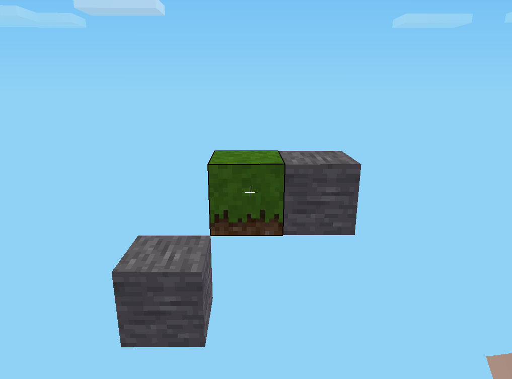
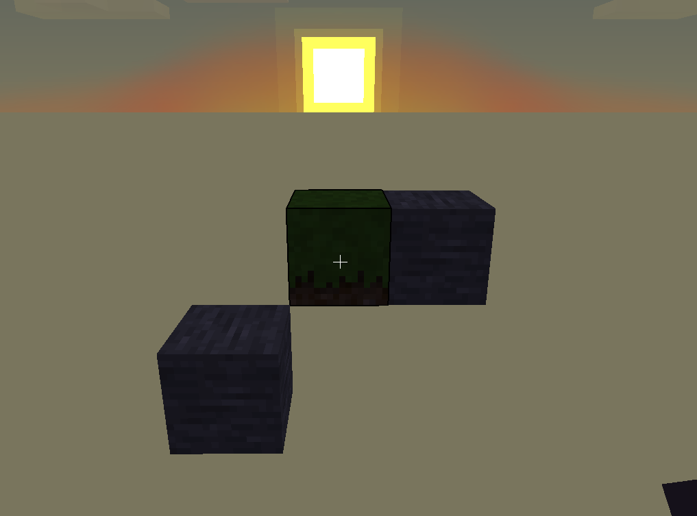

# Overview
The generator has three main interfaces:
+ `VoxelWorld` : Its two main methods are
  + `save()` which is responsible for generating the game's map folder
  + `getFactory()` which returns the associated `VoxelTypeFactory` responsible for the instantiating the appropriate `VoxelType` objects
+ `VoxelType` : Its main function is the `place()` method which adds the voxel to its associated world's voxel grid
+ `voxelTypeFactory` : This class has one method `createVoxelType()` responsible for generating a new `VoxelType`

For each of these interfaces, there are concrete classes associated with a "game". The concrete `VoxelWorld` class for Minetest is `MTVoxelWorld`.

# Minetest example

## Step-by-step guide

### Instantiation of a `VoxelWorld`

```java
VoxelWorld minetestWorld = new MTVoxelWorld();
```

### Instanciation of a VoxelType

In Minetest, the term "nodes" is used to refer to its voxels. There are various of types of nodes, such as Dirt with Grass, Sand, etc.
We use `SemanticType` in order to have a generic way of calling the nodes across the different games.

Semantic types are associated with Minetest nodes in `createVoxelType()` method of `MTvoxelTypeFactory` class.
```java
// Gets minetestWorld associated factory   
VoxelTypeFactory voxelTypeFactory = minetestWorld.getFactory();

// Creates the equivalent of a Minetest's "Dirt with Grass" node
VoxelType grassVoxel = voxelTypeFactory.createVoxelType(SemanticType.Grass);
// Creates the equivalent of a Minetest's "Stone" node
VoxelType stoneVoxel = voxelTypeFactory.createVoxelType(SemanticType.Stone);
```

### Voxel placing

```java
// places a grass voxel at the position (x = 0, y = 0, z = 0)
grassVoxel.place(0, 0, 0);
stoneVoxel.place(0, 0, 1);
// places another stone voxel at the position (x = 1, y = -1, z = -1)
stoneVoxel.place(1, -1, -1);
```

### Generating the map folder

This will create a new folder named `sampleWorld` containing the necessary files for Minetest.
```java
minetestWorld.save("/home/john/.minetest/worlds/sampleWorld/");
```
If `sampleWorld` already exists, the generation will fail. The parent directory must exist.
### Result

A screenshot of the generated voxels from the perspective `(x = 5, y = -1, z = 0)`


Same perspective but during sunset. (In Minetest, the sun's path aligns with the x-axis.)


## Complete Code

```java
import com.ignfab.minalac.generator.*;
import com.ignfab.minalac.generator.VoxelTypeFactory;
import com.ignfab.minalac.generator.minetest.MTVoxelWorld;
import com.ignfab.minalac.generator.MapCreationException;

public class SampleCode {
  public static void main(String[] args) throws OutOfWorldException, MapCreationException {
    VoxelWorld minetestWorld = new MTVoxelWorld();
    VoxelTypeFactory voxelTypeFactory = minetestWorld.getFactory();

    VoxelType grassVoxel = voxelTypeFactory.createVoxelType(SemanticType.Grass);
    VoxelType stoneVoxel = voxelTypeFactory.createVoxelType(SemanticType.Stone);

    grassVoxel.place(0, 0, 0);
    stoneVoxel.place(0, 0, 1);
    stoneVoxel.place(1, -1, -1);

    minetestWorld.save("/home/john/.minetest/worlds/sampleWorld/");
  }
}
```
# How to add new voxel types

At the moment, we support four types of Minetest nodes. To add others :
+ Add an enum constant in `SemanticType` class
+ In `MTVoxelTypeFactory` class within the `createVoxelType()` method, add the corresponding case in the switch statement.